# Unity模组管理器使用指引

本软件可以修改和管理Unity游戏内资源文件实现游戏的模型，贴图，声音等资源的替换。
本软件本身不提供模组，需要到其他地方搜索下载。
本软件目前测试过的游戏有崩坏3
要进行游戏的模组管理，操作步骤如下：
* 安装游戏客户端到软件的虚拟环境
* 导入模组文件到模组列表，并启用需要启用的模组
* 如果游戏需要用第三方软件进行登录需要调整附加组件以及应用可见性设置
* 应用模组补丁并启动游戏

## 安装游戏客户端到软件的虚拟环境

> 此版本已经支持免签名验证功能，也就是说可以安装整合包

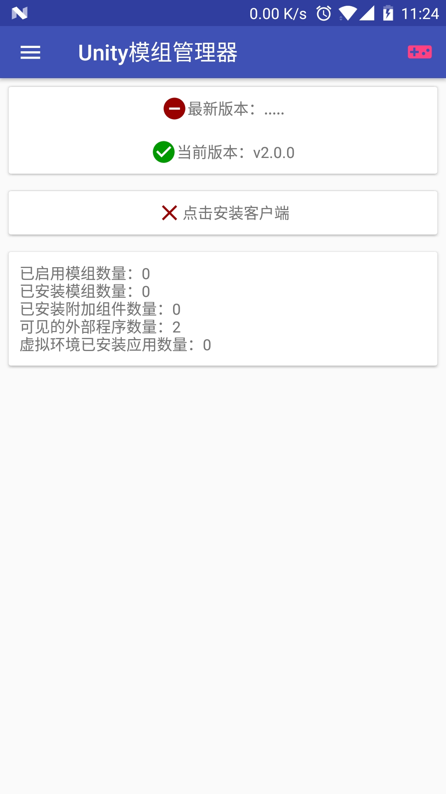

打开软件主页界面，点击 【点击安装客户端按钮】

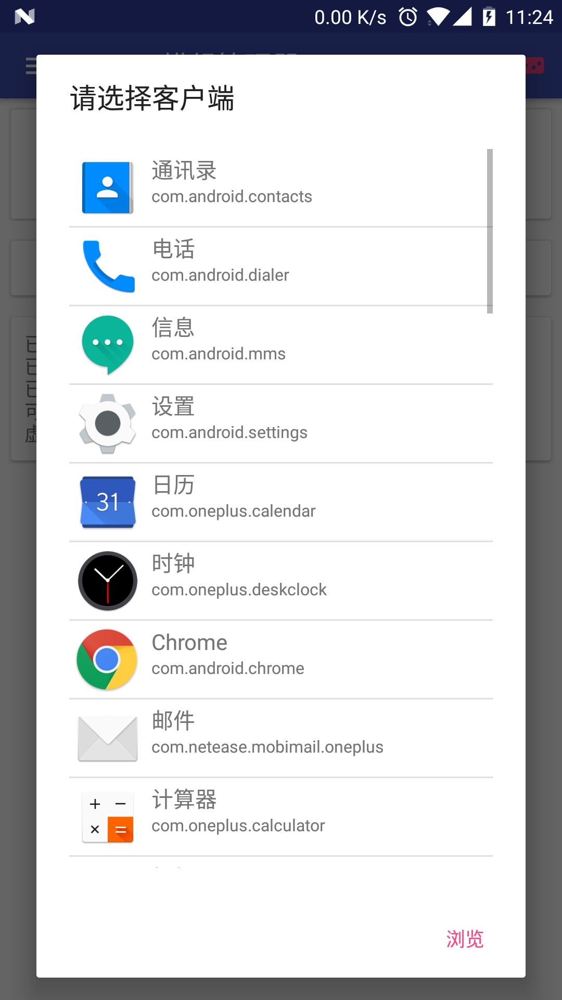

选择游戏客户端或者浏览一个APK文件安装

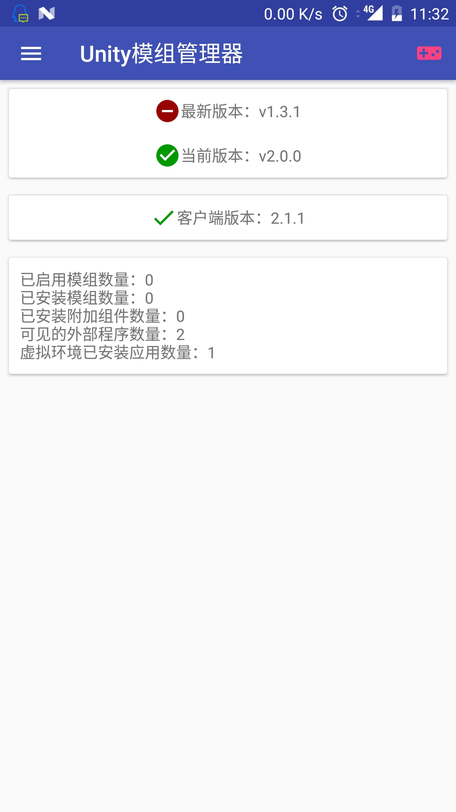

安装好后按钮上会显示客户端版本，可再次点击进行更新或者重装

## 导入模组文件到模组列表，并启用需要启用的模组

> 此版本支持zip格式模组文件，以及文件夹格式的压缩文件，并且支持批量导入

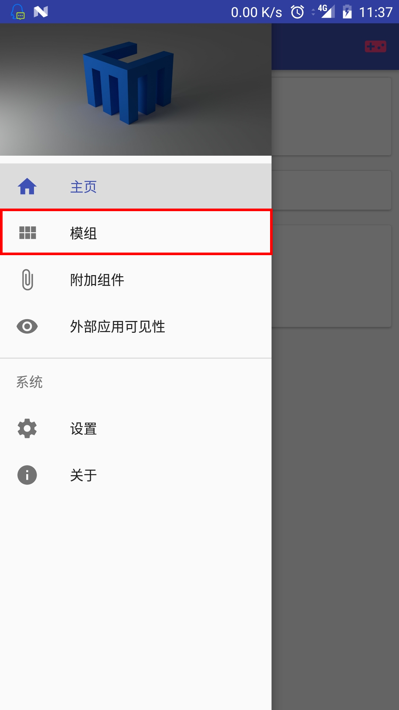

点击软件界面左上角汉堡菜单键，弹出抽屉式菜单，点击模组功能

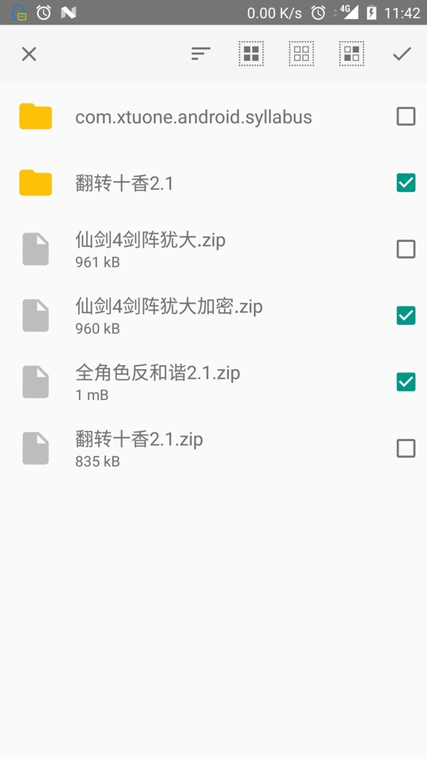

点击右下角加号会打开文件管理器选择模组(会自动过滤，只显示zip文件和目录)，可以长按批量选择

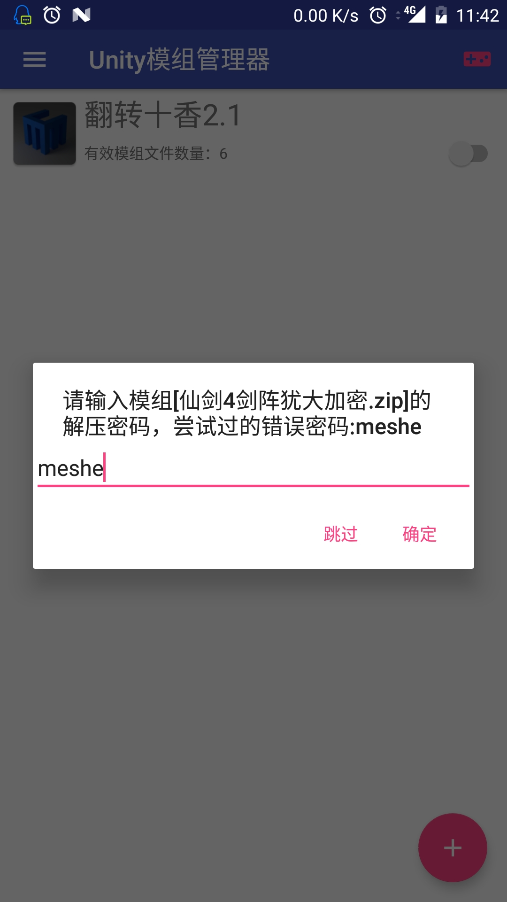

程序会进行导入，如果是带密码的zip文件会提示输入密码,会先自动尝试设置界面里面的默认解压密码

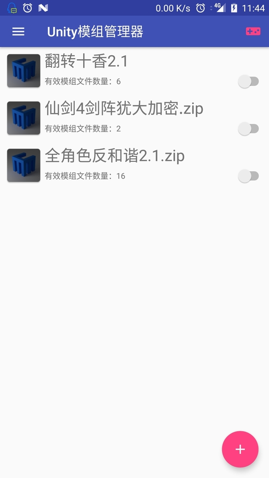

列表将新增导入的模组文件，可以长按调整顺序，右边开关选择是否启用，左右滑动删除模组。（请忽略那个图标，后期打算显示预览图）

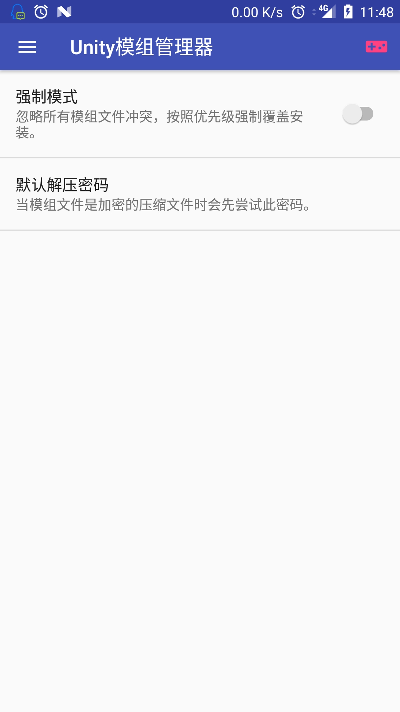

模组导入的时候如果出现模组文件冲突可以到设置界面开启强制安装（按照优先顺序自动解决冲突）

## 调整附加组件以及应用可见性设置

如果客户端需要使用第三方登录，比如QQ，微信或者各种游戏中心登录，那么有两种方法处理。
1. 调整应用可见性，将各种游戏中心添加到可见性列表（实测QQ或者微信登录行不通，请使用第二种办法）
2. 将登录所需的应用作为附加组件也安装到虚拟环境

> 推荐先尝试应用可见性功能，因为调整应用可用性可以保留应用的数据，无需再次登录，如果安装附加组件到虚拟环境需要再次登录，并且可能无法与真实环境同时登录一个账号。

### 调整应用可见性

> * 应用可见性开启就是说虚拟环境内的应用（游戏客户端）会认为该应用也被安装到机器上（默认是隔离的，也就是虚拟环境内的应用会认为机器上只安装了虚拟环境内已安装的应用）
> * 注意：但真实环境内的应用不会认为游戏客户端被安装到机器上（这就是为什么QQ和微信登录用这个方法行不通，因为会检查客户端签名）
> * 默认将微信和支付宝添加到了列表内，是因为可以用这种方法氪金（可以打开窗口，没氪过）

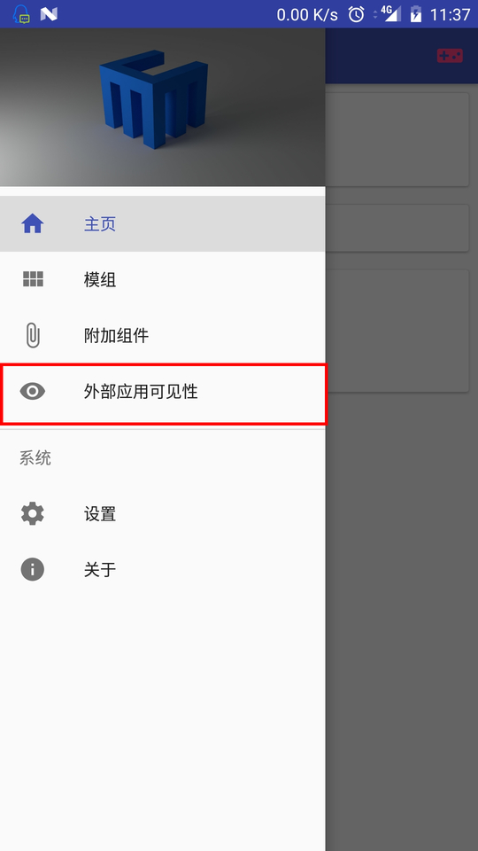

打开菜单，选择应用可见性

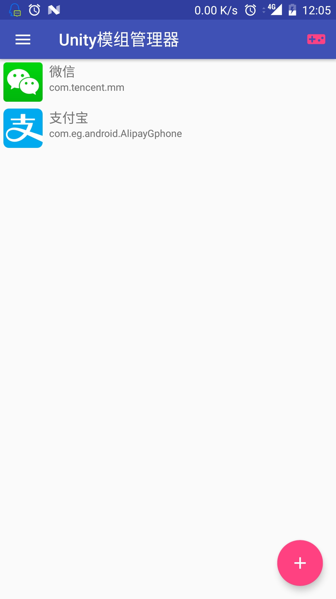

点击右下角加号添加一个应用到列表左右滑动可以删除可见性，点击可以启动对应应用

### 附加组件

> 如果调整应用可见性行不通那么就只能添加登录需要的第三方软件到虚拟环境，需要重新登录账号

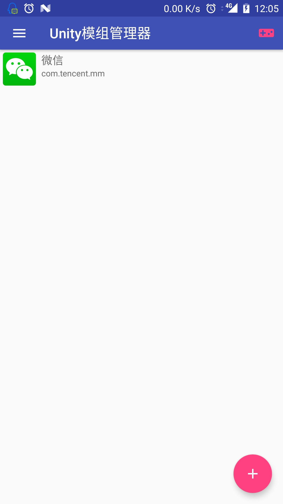

打开菜单，选择附加组件

点击右下角加号选择一个应用或者APK文件到虚拟环境作为附加组件，左右滑动删除附加组件，点击可以启动对应应用

## 应用模组补丁并启动游戏

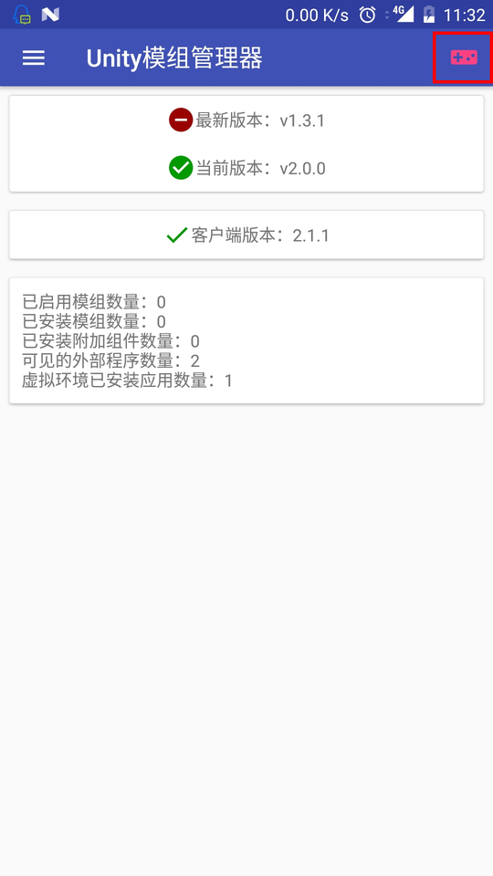

点击右上角的游戏手柄图标，程序会应用模组到客户端，并且启动客户端，如果出现模组文件冲突可以到设置界面开启强制安装
